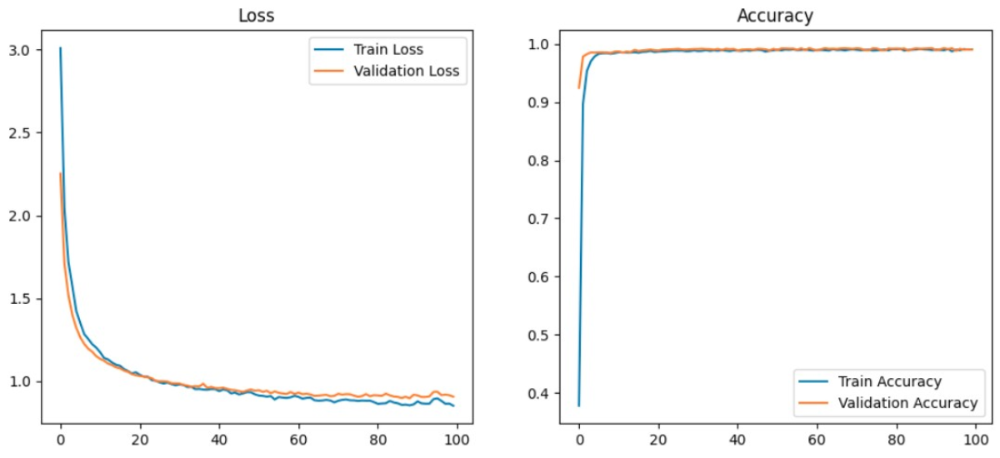
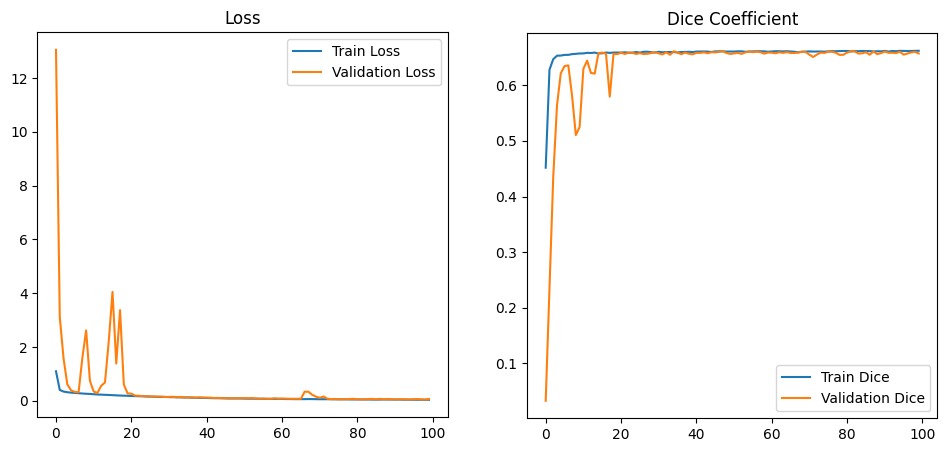
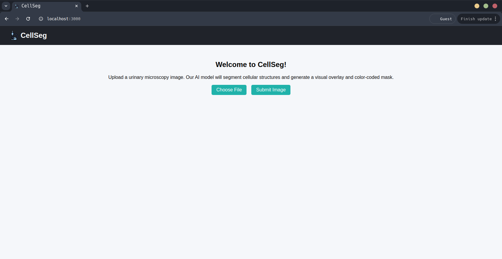
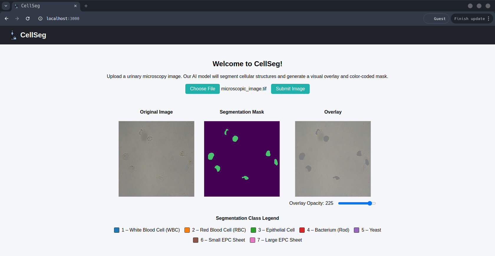

# CellSeg


### **Table of content**
- [Description](#description)
- [Thesies](#thesies) 
- [Project Structure](#project-structure)
- [Setup Requirements](#setup-requirements)
- [Results](#results)
- [Demonstrator](#demonstrator)
- [Credits](#credits)

## Description

This project aims to build upon the work presented in _A Clinical Microscopy Dataset to Develop a Deep Learning Diagnostic Test for Urinary Tract Infection (2024)_, by extending the segmentation task from binary to multiclass urinary cell segmentation. The study explores and compares convolutional neural network architectures with the goal of understanding their design principles, implementation differences and performances in a biomedical image context. A lightweight web demonstrator is also developed as an addition component for visualization.


## Thesies

For more details on this project please check this document:

- **[Automatic Segmentation of Urinary Cells](./Automatic_Segmentation_of_Urinary_Cells_Thesies.pdf)**

## Project Structure

```plaintext
CellSeg/
├── data/       # Markdown about the dataset used
├── notebooks/  # The code for implementing and training the three models
├── utils/      # Useful python scripts
├── resources/  # Different photos used for the README.md
├── webapp/     # Web integration of the best model
└── Automatic_Segmentation_of_Urinary_Cells_Thesies.pdf # Final thesies
```

## Setup Requirements

As a recommendation please check the [dataset summary](./data/) to better understand the project.

All model implementations were developed and trained in **Google Colab**.

To run any model:

1. Open the corresponding notebook using the **Colab badge** provided in each file in the [notebooks](./notebooks/) folder
2. Connect to a GPU runtime:
    *Runtime → Change runtime type → Hardware accelerator → GPU.*  
3. Follow the notebook instructions to train, evaluate, or visualize results.

If you want to use the **CellSeg web demonstrator** locally:

```bash
# Clone this repository
git clone https://github.com/MateiGoidan/CellSeg.git
cd webapp/backend

# Start the FastAPI server
uvicorn main:app --reload

``` 

For the frontend:
```bash
cd ../frontend
npm install
npm start

```

Then open your browser at `http://localhost:3000` to access the demo interface.

## Results

The main objective of this thesis is to implement three convolutional neural network architectures a simple CNN, U-Net, and DeepLabV3+ to evaluate and compare the architectures in regards to performance and complexity when put to the task of multiclass cell segmentation. The three architectures demonstrate varying capabilities in their ability to handle cell types:

- **The Simple CNN** achieves high pixel accuracy, but fails to detect most cell structures.
- **U-Net** is significantly better at learning global and local features, showing better results across all classes.
- **DeepLabV3+ further** improves the segmentation accuracy, achieving the highest Dice Score and best class detection.

DeepLabV3+ proves to be the most effective for multiclass urinary cell segmentation, although it also requires the most computational resources.

<p align="center">
  
  
</p>

<p align="center">
  <em>Left:</em> U-Net training performance. 
  <em>Right:</em> DeepLabV3+ training performance.
</p>

## Demonstrator

As an aditional component to this thesis, I developed a lighweight demonstrator application named **CellSeg**, which offers a practical interface for testing the DeepLabV3+ segmentation model that I trained. The application allows users to upload microscopy images and receive real time segmentation results directly in the browser. The system follows a client-server architecture and is composed of three main components:

- **React.js** frontend that handles uploaded images and display results.
- **FastAPI** backend (written in Python) that handles the processing of images and model inference.
- **DeepLabV3+** model implemented in Keras and loaded on the server for prediction.

---

### Gallery





## Credits

This project was developed as part of my **Bachelor’s Thesis** at the **Faculty of Mathematics and Computer Science (FMI), University of Bucharest**, under the supervision of **Assoc. Prof. Sergiu Nisioi, PhD**.

The work builds upon these public research papers:

> Kevin Liou, Aaron Rosenberg, Guneet Sandhu, Pooja Zaveri, Rachel Ostfeld, David Lansky, Manisha Narayan, Lauren G. McCoy, and Steven Horng. “A clinical microscopy dataset to develop a deep learning diagnostic test for urinary tract infection.” (2024);

> Olaf Ronneberger, Philipp Fischer, and Thomas Brox. “U-Net: Convolutional Networks for Biomedical Image Segmentation.” (2015);

> Liang-Chieh Chen, Yukun Zhu, George Papandreou, Florian Schroff, and Hartwig Adam. “Encoder-Decoder with Atrous Separable Convolution for Semantic Image Segmentation.” (2018);

> François Chollet. “Xception: Deep Learning with Depthwise Separable Convolutions.” (2017);

All rights and credits belong to the original authors.
